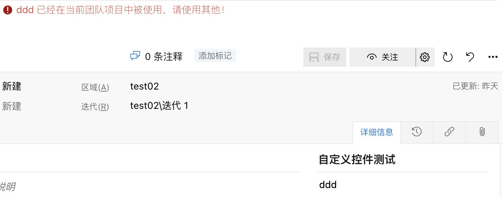

[](https://github.com/smallidea/azure-devops-extension-custom-control-sample) 

# Azure DevOps 插件: Field Unique Control

[[_TOC_]]

## 一. 概述
 验证字段值的唯一性，如果相同类型的工作项使用了该值，将报错，当前工作项不能保存。

 - [如何开发自定义控件](https://www.visualstudio.com/en-us/docs/integrate/extensions/develop/custom-control)

 - [如果使用web技术开发一个插件](https://docs.microsoft.com/en-us/azure/devops/extend/get-started/node?view=azure-devops)



## 二. 快速开始 

1. 克隆git库，并进入目录

``` shell / cmd / bash
git clone https://github.com/smallidea/azure-devops-extension-custom-control-sample.git

cd azure-devops-extension-custom-control-sample
```
        
3. 运行 `npm install` 安装项目所需要的npm包
4. 运行 `npm run publish`，里面的tfs地址和token需要根据具体项目进行修改
5. 在浏览器中访问你的tfs站点, `http://YourTFSInstance:8080/tfs`.
> 建议使用chrome 70版本以上
6. 手动安装并启用插件
   - 集合设置 > 扩展 > 浏览本地插件 > 管理本地扩展 > 上传扩展 > 浏览本地文件上传插件
   - 点击进入插件详情 > 免费获取 > 选择集合，点击启用
7. 手动更新插件
   - 集合设置 > 扩展 > 浏览本地插件 > 管理本地扩展
   - 找到需要更新的插件，点击名称后的三个点 > 选择更新 > 浏览本地文件上传插件

## 三. 
## 使用 vss-web-extension-sdk 进行开发

使用 [vss-web-extension-sdk](https://github.com/microsoft/vss-web-extension-sdk)Microsoft VSS Web 扩展 SDK 包，英文全称 Visual Studio Services Web Extension SDK
，此 SDK 包括一个 JavaScript 库，该库提供与嵌入你的扩展插件的页面进行通信所需的 Api。

```typescript
import * as VSSService from "VSS/Service";
import * as WitService from "TFS/WorkItemTracking/Services";
import * as ExtensionContracts from "TFS/WorkItemTracking/ExtensionContracts";
import * as Q from "q";
```

## API
| API                | 函数                   | 用途                                                                     |
| ------------------ | --------------------------- | ------------------------------------------------------------------------- |
| VSSService         | VSS.getConfiguration()      | 可以获取到相应的配置      |
| WitService         | getService()                | 返回一个服务器实例                    |
|                    | getFieldValue()             | 获取当前工作项字段的值值                                    |
|                    | setFieldValue()             | 设置当前工作项字段的值       |
|                    | getAllowedFieldValues()     | 获取字段的洋允许的值，即在配工作项模版配置时的下拉框中的选项列表                                    |


### 使用示例 
获取允许的值
```typescript
WitService.WorkItemFormService.getservice().then(
    (service) => {
        service.getAllowedFieldValues(this._fieldName), (allowedValues: string[]) => {
            // do something
        }
    }
)
```

使用Q来处理回调, 当有多个回调时，可以使用Q.spread

```typescript
WitService.WorkItemFormService.getService().then(
    (service) => {
        Q.spread<any, any>(
            [service.getAllowedFieldValues(this._fieldName), service.getFieldValue(this._fieldName)],
            (allowedValues: string[], currentValue: (string | number)) => {
                //do something
            }
        )
    }
)
```

抛出错误，阻止保存
```

```

### 目录结构 ###

```
/src                - Typescript code for this extension
/static/css         - Custom CSS assets for extension
/static/images      - Image assets for extension and description
/static/index.html  - Main entry point
```

#### Grunt ####

Two basic `npm` tasks are defined:

* `build` - Compiles TS files in `dist` folder
* `publish` - Generates the ```.vsix``` file to publishes the extension to the marketplace using `tfx-cli`